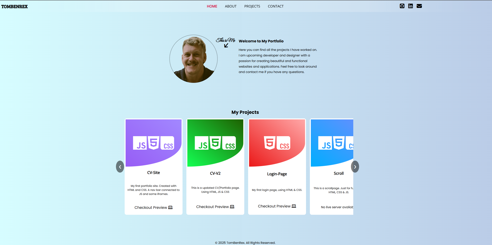

<!--

 
  
  
  

-->

:point_right:<a href="https://tombenrex.github.io/CV-V2/" target="blank">Live Server</a> :point_left:

 

##

<h1 align="center">Hi 👋, I'm Tom Larsson</h1>
<h3 align="center">An upcoming frontend developer from Sweden</h3>

  

- 🌱 I’m currently learning **HTML, Javascript, CSS, React**

- 📫 How to reach me **92tomlar@skola.boras.se**

- ⚡ Fun fact **Started build houses now building webpages**

<h3 align="left">Connect with me:</h3>

<h3 align="left">Languages and Tools:</h3>

    

## Instruktioner

Denna uppgift bygger vidare på Uppgift 1 och i denna ska du utveckla din CV-sida så den även innehåller JavaScript och blir mer dynamisk.

Du får endast utveckla sidan med ren JavaScript (d.v.s Vanilla)

## Vad du ska göra

Du ska bygga vidare på din CV-sida från Uppgift 2 och nu se till att den även följer följande kravställningar:

### **CV i en fil**

- Dina utbildningar och tidigare arbetsplatser ska inte längre ligga i HTML-koden
- Vilka utbildningar du läst och vilka tidigare arbeten du haft ska ligga i en separat fil i JSON-format
- Denna JSON-fil ska läsas och generera ditt CV

### **Interaktiva scripts**

- Din CV-sida ska innehålla minst ett interaktivt JavaScript-element som du själv har skrivit. Dessutom ska du integrera minst en interaktiv funktion som är baserad på en befintlig ren JavaScript-lösning (ej från ett bibliotek).
  - Exempel på funktioner kan vara en modal, bildspel, scroll-effekt, eller funktioner för att dölja/visa element.
  - Var noga med att kommentera din kod för att tydligt ange vilka delar du har skrivit själv och vilka delar som är baserade på externa källor. Ange också källan för den externa koden.
  - För att hitta lämpliga skript kan du utforska resurser som GitHub, CodePen, eller MDN Web Docs, vilka erbjuder en mängd exempel och kodsnuttar som kan användas som inspiration eller som grund för dina egna projekt."
- Exempel på funktioner kan vara en modal, bildspel, scroll-effekt, eller funktioner för att dölja/visa element.
- Var noga med att kommentera din kod för att tydligt ange vilka delar du har skrivit själv och vilka delar som är baserade på externa källor. Ange också källan för den externa koden.
- För att hitta lämpliga skript kan du utforska resurser som GitHub, CodePen, ell- er MDN Web Docs, vilka erbjuder en mängd exempel och kodsnuttar som kan användas som inspiration eller som grund för dina egna projekt."

### **Portfolio**

- Det ska finnas en del av din sida som är en portfolio med projekt du byggt.
- Du publicerar ett fungerande projekt från Workshop JS Code (Fiska Animation kod till exempel)på ditt Githubkonto och inkluderar det i din portfolio.

### Tekniska krav

- Validerad med 0 fel på [https://validator.w3.org/Links to an external site.](https://validator.w3.org/)
- Inga errors i Console
- Webbplatsen ska vara tekniskt optimerad för sökmotorer, vilket inkluderar korrekt användning av semantiska HTML5-element, metataggar som titel och beskrivning och optimerade bilder för snabba laddningstider.
- I roten i ditt repository ska det finns en README.md-fil skriven i Markdown. I denna fil ska det minst framgå vem som skapat sidan (ditt namn) och länken till den publicerade versionen (t.ex på Github Pages)
